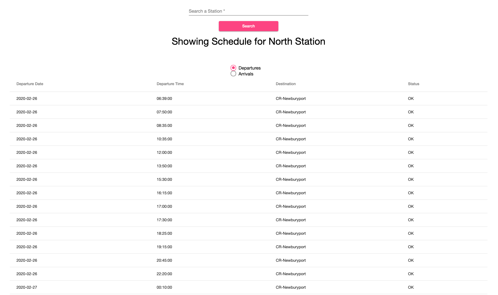
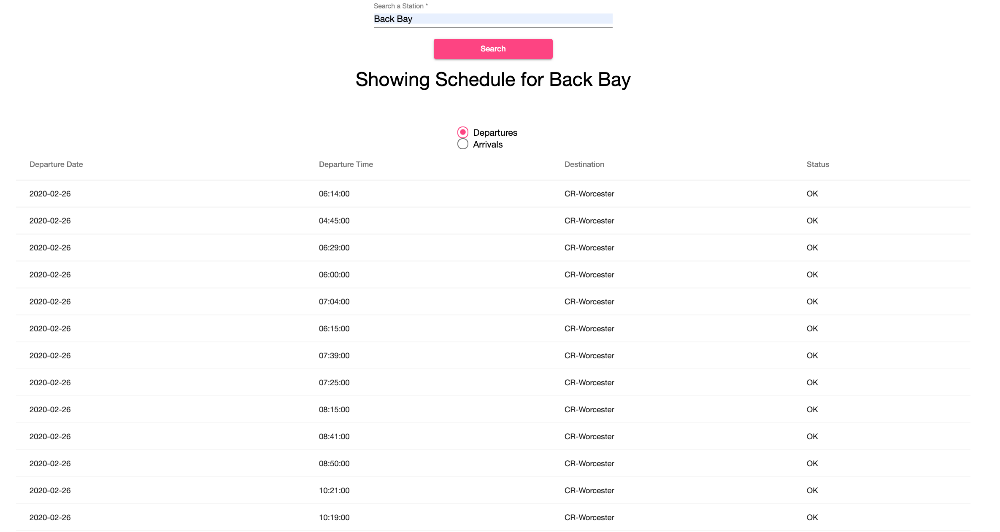

# MbtaSchedule

This project shows the arrivals and departures for a given MBTA Commuter Rail Station. 

# Screenshots

## Development server

Run `ng serve` for a dev server. Navigate to `http://localhost:4200/`. The app will automatically reload if you change any of the source files.

# Notes

https://api-v3.mbta.com/schedules?filter[stop]=North%20Station

this looks pretty close to what we want
